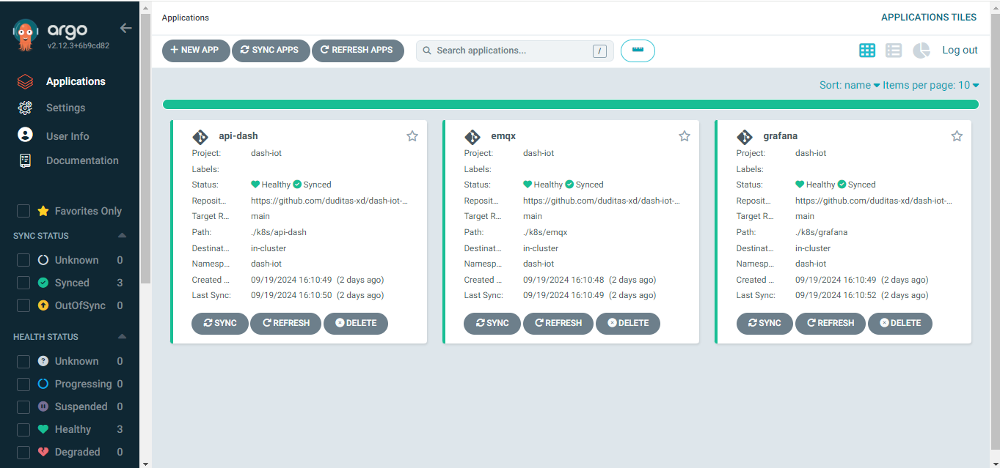

# ArgoCD-for-Github-Actions

Este repositorio es una demostración archivos Docker, manifiestos de Kubernetes y GitHub Actions para la entrega continua y despliegue utilizando ArgoCD. El proyecto muestra los archivos que he creado automatizar los procesos de despliegue y gestionar infraestructura como código.

## Resumen del Proyecto

Este proyecto está diseñado para mostrar la integración de:
- **ArgoCD**: Para la entrega continua basada en GitOps.
- **GitHub Actions**: Para automatizar los flujos de trabajo de CI/CD.
- **Docker**: Para la gestión y creacion de imagenes.
- **Kubernetes**: Para gestionar el despliegue de aplicaciones mediante manifiestos.

## Componentes Principales

### 1. Archivos Docker
Los archivos Docker se utilizan para crear entornos en contenedores para la aplicación.

- Ejemplo de Dockerfile para la aplicación
- Instrucciones para construir la imagen y ejecutarla localmente

### 2. Manifiestos de Kubernetes
Los manifiestos de Kubernetes definen la configuración del despliegue y el servicio para ejecutar las aplicaciones en un clúster de Kubernetes.

### 3. GitHub Actions
GitHub Actions se utiliza para automatizar el pipeline de CI/CD, que se encarga de construir, probar y desplegar la aplicación. El flujo de trabajo se activa con cada commit o pull request en la rama principal o cambios en los archivos actions

- `.github/workflows/deploy.yml`: Contiene el flujo de trabajo de CI/CD para el proyecto.

## Demo
